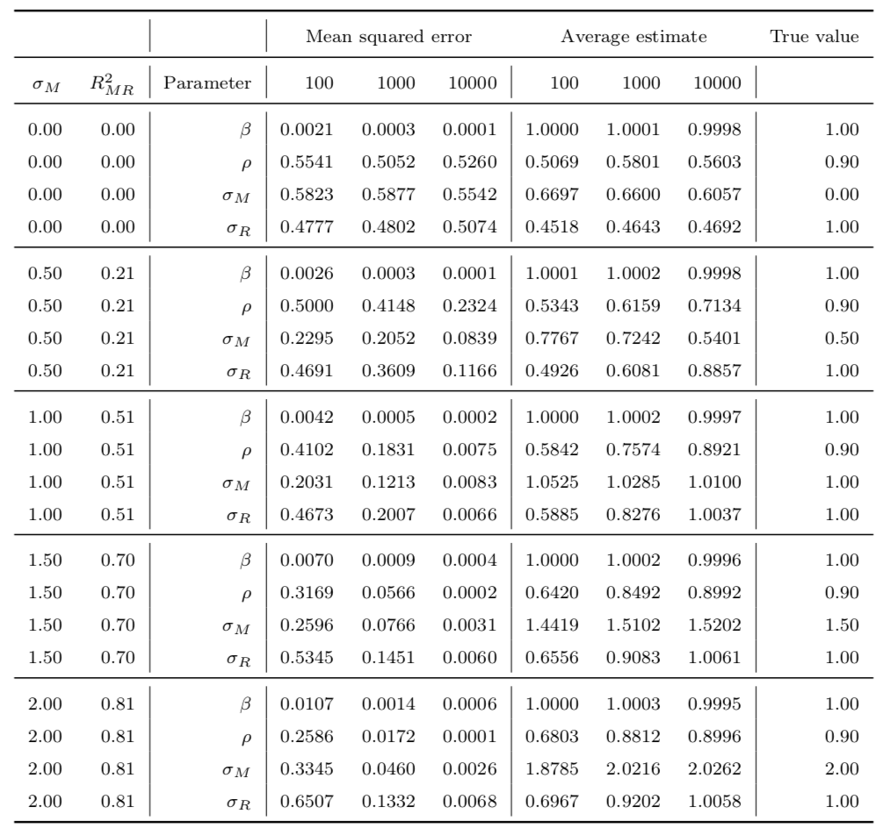
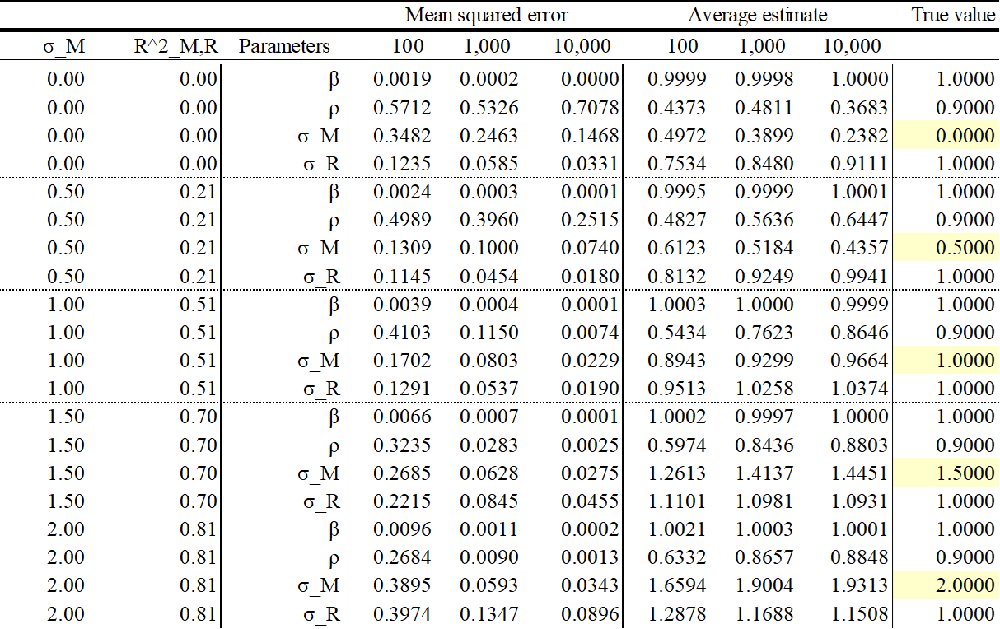
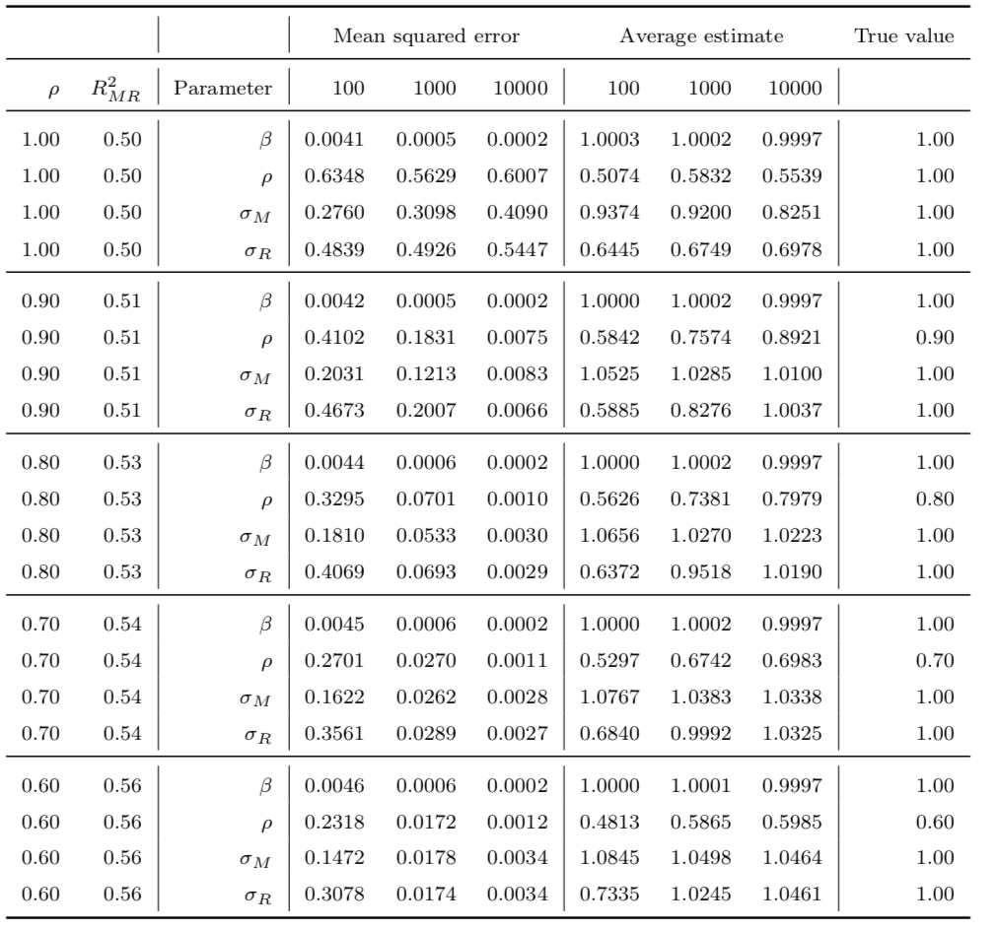
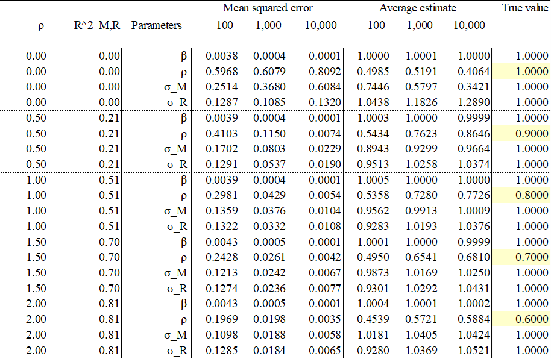
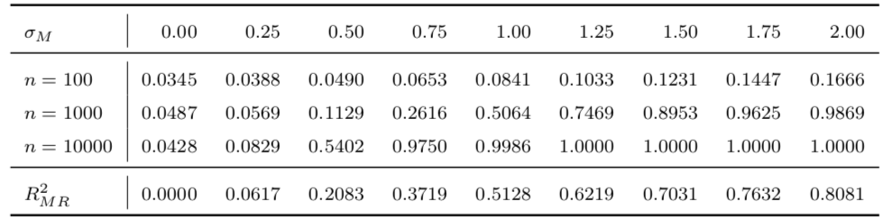
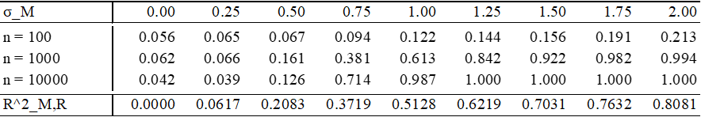
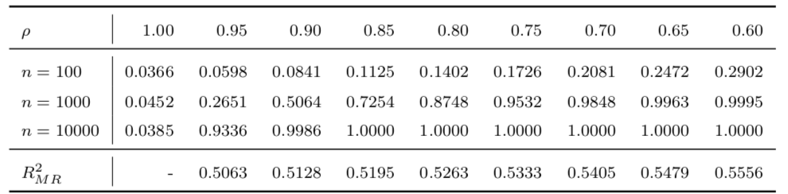
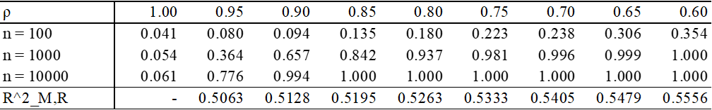

# PCI Project - Trading Club HEC
*Version 0.1*

**Authors** : *Sébastien Caron, Antoine Chartrand-deniger, Philippe Gagné*

---
Table des matières:

- [Introduction](#introduction)
- [Simulation](#simulation)
    - [Table 3](#table-3)
    - [Table 4](#table-4)
    - [Table 5](#table-5)
    - [Table 6](#table-6)
    - [Conclusion simulation](#conclusion-simulation)
- [Stratégie V1](#stratégie-v1)
    - [Données](#données)
    - [Spécification du modèle](#spécification-du-modèle)
    - [Sélection des pairs](#sélection-des-pairs)
    - [Règles de trading](#règles-de-trading)
    - [Backtesting](#backtesting)
    - [Résultats](#résultats)
    - [Améliorations](#améliorations)

- [Étude hypothèses du modèle (empiriquement)](#étude-hypothèses-du-modèle)

---
## Introduction
Les recherches effectuées sont basées sur les papiers suivants:

1. [Modeling Time Series with Both Permanent and Transient Components Using the Partially Autoregressive Model](https://papers.ssrn.com/sol3/papers.cfm?abstract_id=2556957)
2. [Pairs trading with partial cointegration](https://www.econstor.eu/bitstream/10419/140632/1/858609614.pdf)

En premier lieu, nous étudions le comportement du modèle spécifié dans l'ouvrage PCI en donnée simulé. Nous comparons nos résultats avec ceux de l'auteur. 

En deuxième lieu, nous testons la stratégie de l'auteur sur les constituants du Nasdaq 100 de 1995 à 2023 (donnée journalière). Nous backtestons à l'aide de Vector BT Pro. 

## Simulation
Nous reproduisons les résultats obtenus par l'auteur, soit les tableaux 3-6. Comme les estimateurs sont calculés par maximum de vraisemblance (sauf β), on s'attend à ce qu'ils soient (1) asymptotiquement normaux, (2) efficient, et (3) consistants. Dans nos conclusions pour les tableaux 3 et 4, nous vérifions la propriété #1 et 3. Pour ce faire, nous estimons les paramètres du modèle sur une collection simulée (de taille B) de paires de séries chronologiques partiellement cointégrées. Plus spécifiquement, les paramètres pour les simulations de Monte Carlo pour la réplication du tableau 3 sont définis comme suit : α = 0, β = 1, ρ = 0.9, σ_R = 1, σ_X = 0.0236 et σ_M = [0.00, 0.50, 1.00, 1.50, 2.00]. La taille des échantillons est fixée à n = [100, 1000, 10000]. Notons la taille de la liste du paramètre variable (σ_M dans ce cas) comme P, et la taille de la liste des tailles d’échantillons (n) comme N. Nous générons B = 10,000 simulations pour chaque combinaison de paramètres possibles, estimant les paramètres pour chacune. Ceci revient à estimer nos paramètres sur B x P x N paires différentes, soit 10,000 x 5 x 3 = 150,000. Pour le tableau 4, les paramètres sont similaires, mais nous fixons σ_M = 1 et ρ = [1.00, 0.90, 0.80, 0.70, 0.60]. Nous concentrons notre analyse sur les paramètres ρ, σ_M et σ_R, puisque β est estimé par la méthode des moindres carrées ordinaires, qui n’est pas le centre d’attention du modèle PCI.

Pour le tableau 5 et 6, nous utilisons le likelihood ratio test pour évaluer l’hypothèse nulle (H0) que la série temporelle est une marche aléatoire. Si H0 est rejeté, nous assumons que la série cointégrée suit soit un modèle partiellement autorégressif, ou un modèle autorégressif. Nous reportons la valeur de la puissance du test d’hypothèse par méthode de simulations Monte Carlo. Les paramètres sont similaires à ceux définis pour les tableaux 3 et 4. Cependant, nous utilisons des pas plus petits pour les valeurs de σ_M et ρ.

---
### **Table 3** 
 * Erreur quadratique moyenne (MSE) et estimation moyenne par rapport aux paramètres réels pour différentes tailles d'échantillons n et différents niveaux de σ_M, donc différents niveaux de R²_MR. *

##### Résultat de l'auteur : 

##### Notre résultat :

##### Conclusion

La conclusion de ce tableau que nous trouvons pertinente pour des fins de trading est le fait que les erreurs quadratiques moyennes pour ρ, σ_M et σ_R sont raisonnablement bas qu’à partir du moment où n >= 1000 et R^2_M,R >= 0.51. Ces deux faits devraient se refléter dans nos critères de sélection pour une paire d’action.
Une autre remarque importante est le fait que les distributions de nos estimateurs semblent bien converger asymptotiquement vers une Gaussienne, quoique celle-ci est asymétrique. Cela implique que nos estimateurs sont biaisés. En particulier, nous sous-estimations ρ et σ_M, et nous surestimons σ_R. Heureusement, comme le biais est faible, nous considérons que le modèle est suffisamment précis pour des fins de trading.

---

### **Table 4**
  * Erreur quadratique moyenne (MSE) et estimation moyenne par rapport aux paramètres réels pour différentes tailles d'échantillons n et différents niveaux de ρ, donc différents niveaux de R²_MR et de demi-vie de retour à la moyenne. *

##### Résultat de l'auteur : 

##### Notre résultat : 

##### Conclusion

Ce tableau nous permet de voir que les erreurs quadratiques moyens de nos estimateurs sont plus faibles lorsque la valeur de ρ est faible. Ceci suggère que l’on devrait chercher pour des paires qui la composante stationnaire mean-reverts plus rapidement. L’on remarque aussi que lorsque ρ = 1, la série dégénère en une marche aléatoire, rendant les estimations non consistantes.

---
### **Table 5**
 *Power of likelihood ratio test with null hypothesis of ”random walk” for varying sample size n and different levels of σM , thus different levels of R2 .*

##### Résultat de l'auteur : 

##### Notre résultat : 

##### Conclusion

Tout d’abord, le tableau suivant démontre que lorsque σ_M = 0, et donc la série cointégrée est une marche aléatoire pure, le test d’hypothèse rejette incorrectement H0 environ 5% du temps, exactement ce que l’on s’attend à un niveau de confiance de 95%. Par la suite, l’on remarque que plus la valeur de σ_M augmente, plus la probabilité de rejeter correctement H0, c.-à-d. la puissance, est élevé. Pour n = 1000, une taille d’échantillon représentant environ 4 ans de données du marché, nous rejetons l’hypothèse nulle correctement >50% du temps à partir du moment que σ_M >= 1. Notons que cette observation est une autre bonne raison d’utiliser R^2_M,R >= 0.51 comme critère de sélection. Lorsque n = 100, le test d’hypothèse n’est pas en mesure de rejeter l’hypothèse nulle correctement la majorité du temps, signifiant qu’il faudra des échantillons assez gros en pratique pour trader.

---
### **Table 6**
 *Power of likelihood ratio test with null hypothesis of ”random walk” for varying sample size n and different levels of ρ, thus different levels of R2 and half-life of mean-reversion.*

##### Résultat de l'auteur : 

##### Notre résultat : 

##### Conclusion

Les résultats suivants démontrent encore que lorsque la série est une marche aléatoire pure, le test d’hypothèse rejette incorrectement H0 environ 5% du temps. Sinon, nous remarquons que la puissance augmente rapidement au fur et à mesure que ρ diminue.

---

